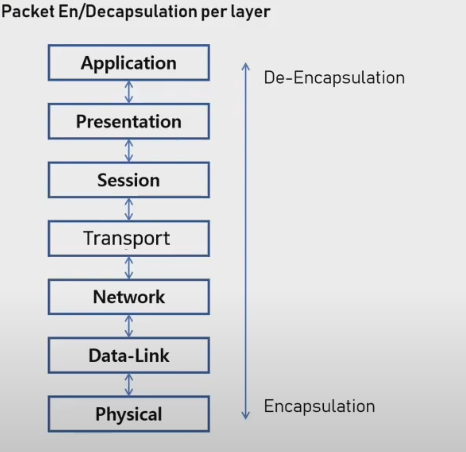
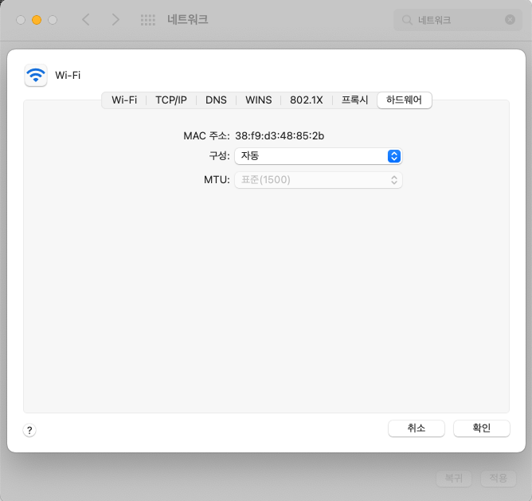

# CH1. 네트워크, OSI 7계층 💁🏻

> 💡 네트워크를 구상할때 이것을 참조해서 만들어라 라고하는 참조모델 , 네트워크에서 통신이 일어나는 과정을 7단계로 나눈 것

## 왜 7계층으로 나눴는가?

통신이 일어나는 과정을 단계별로 파악 할 수 있기 때문 이상이 특정한 곳에만 생기면 그곳만 수정하면됨

## OSI 7계층은 Stack 계층

하위 계층으로 내려갈 수록 캠슐화가 진행되고 상위계층으로 올라갈수록 디캡슐화가 진행됨

즉 하위계층으로 갈수록 데이터 전송단위가 커지는것

데이터 통신을 하는데 있어 PDU를 표준으로 통신하고 이 양식을 맞추기 위해 캡슐화 or 디캡슐화 진행하는것

## 7계층 - 응용 계층 (Application Layer)

- HTTP, FTP,www.Telnet등의 프로토콜이 이 계층에 포함됨
- 브라우저,메일 시스템 등을 통해 해당 프로토콜을 용이하게 사용할 수 있게 해줌

## 6계층 - 표현 계층 (Presentation Layer)

- 데이터를 어떻게 표현할지 정하는 역할을 가지고 있는 계층
- 응용 계층으로부터 받은 **데이터를 읽을 수 있는 형식으로 변환**
- 데이터의 인코딩, 디코딩, 암호화, 복호화 기능을 수행
- **확장자의 개념**이 여기서 사용됨
- JPEG,MPEG등이 여기에 포함됨

## 5계층 - 세션 계층 (Session Layer)

- 응용 시스템 간의 세션을 관리(예를 들어 게임할때도 서버랑 통신 필요 )
- 모든 통신 장치 간에 연결을 설정하고 관리 및 종료
- **송신자와 수신자 간의 통신을 위해 동기화 신호**를 주고받음
- 통신방식(단순, 반이중, 전이중)을 결정 → 단순(티비), 반이중(무전기), 전이중(전화)

## 4계층 - 전송 계층 (Transport Layer)

- 하위계층으로 신뢰 할 수있는 데이터 전송 → 하드웨어가 인지할 수있는 데이터 전송이 주목적
- 송신자와 수신자 간의 논리적인 연결을 수행
- 단말(endpoint)간 전달 데이터의 오류를 제어
- 전송단위는 segment, 대표적으로 TCP UDP 프로토콜이 존재 → TCP는 오류를 방지하고 신뢰성있는 데이터 전송방식(일반적인 파일 전송) , UDP는 데이터의 손실이 있더라도 빠른속도로 전송이 목적(알람)

## 3계층 - 네트워크계층(Network Layer)

- 네트워크 계층은 **IP주소**를 제공하는 역할을 수행
- 수신자의 IP주소를 기반으로 라우터가 경로를 제공
- 경로결정은 라우터의 알고리즘에 의해 결정됨
- IP,ICMP,ARP등이 프로토콜이 이계층에 해당됨
- 전송단위는 Packet
- EX) 핑(영어: **ping**)은 컴퓨터 네트워크 상태를 점검, 진단하는 명령, 네트워크 상태를 확인하려는 대상 컴퓨터를 향해 일정 크기의 패킷을 보낸후 대상 컴퓨터가 이에 대해 응답하는 메세지를 보내면 이를 수신, 분석하여 대상 컴퓨터가 작동하는지 또는 네트워크 상태가 어떤지 파악가능
  

## 2계층 - 데이터링크계층(DataLink Layer)

- 물리적인 네트워크를 통해 데이터를 전송하는 기능을 수행
- 주 목적은 물리적인 장치를 식별하는데 사용할 수 있는 **주소 지정 체계를 제공**하는 것
- **투 포인트간** 신뢰성있는 전송을 보장 → 엔드포인트x, 어떤 단말과 통신하는 장비들간의
- 대표적인 장비는 브리지 및 **스위치**
  
- **MAC 주소**(Media Access Control Address)는 네트워크 세그먼트의 [데이터 링크 계층](https://ko.wikipedia.org/wiki/%EB%8D%B0%EC%9D%B4%ED%84%B0_%EB%A7%81%ED%81%AC_%EA%B3%84%EC%B8%B5)
  에서 통신을 위한 네트워크 인터페이스에 할당된 고유 식별자이다. → 모든 장비에 있음( 기기를 식별하는 번호)

## 1계층 - 물리계층(Physical Layer)

- 네트워크 데이터가 전송되는 **물리적인 전송 기술**
- **비트(Bit, 0 또는 1)의 통신단위**로 통신
- 이 계층에 속한 대표적인 장비를 **케이블, 허브, 리피터** → 허브는 데이터전송, 리피터는 장거리 전송

출처 [https://www.youtube.com/watch?v=TBUaVzNkxFg](https://www.youtube.com/watch?v=TBUaVzNkxFg)
